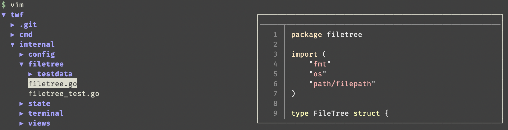

twf - Tree View Find
===

twf is a standalone tree view explorer inspired by [fzf](https://github.com/junegunn/fzf).



Features
--------

- Standalone, usable from vim, the shell or any other program.
- Locate files through external programs such as fzf.
- Customizable previews.
- Optional inline display in the shell.

Installation
------------

### Using [Homebrew](https://brew.sh/)

```sh
brew install --HEAD wvanlint/twf/twf
```

### Using Go

Install Go, and ensure that `$GOPATH/bin` is added to the `$PATH`.

```sh
export GOPATH="$HOME/go"
export PATH="$PATH:$HOME/bin:$GOPATH/bin"
```

Install the Go binary.

```sh
go get -u github.com/wvanlint/twf/cmd/twf
```

Integrations
------------

### In .zshrc

```sh
twf-widget() {
  local selected=$(twf --height=0.5)
  BUFFER="$BUFFER$selected"
  zle reset-prompt
  zle end-of-line
  return $ret
}
zle -N twf-widget
bindkey '^T' twf-widget
```

### In .vimrc

```vim
function! Twf()
  let temp = tempname()
  execute 'silent ! twf ' . @% . ' > ' . temp
  redraw!
  try
    let out = filereadable(temp) ? readfile(temp) : []
  finally
    silent! call delete(temp)
  endtry
  if !empty(out)
    execute 'edit! ' . out[0]
  endif
endfunction

nnoremap <silent> <Space>t :call Twf()<CR>
```

### In .config/nvim/init.vim

```vim
function! TwfExit(path)
  function! TwfExitClosure(job_id, data, event) closure
    bd!
    try
      let out = filereadable(a:path) ? readfile(a:path) : []
    finally
      silent! call delete(a:path)
    endtry
    if !empty(out)
      execute 'edit! ' . out[0]
    endif
  endfunction
  return funcref('TwfExitClosure')
endfunction

function! Twf()
  let temp = tempname()
  call termopen('twf ' . @% . ' > ' . temp, { 'on_exit': TwfExit(temp) })
  startinsert
endfunction

nnoremap <silent> <Space>t :call Twf()<CR>
```

Usage
-----

```sh
twf [flags...] [path]
```

The binary `twf` will output the path that you select in the tree view, so it is usable in scripts and from other programs.
For example, you can try the following commands:

```sh
cat $(twf)
cat $(twf --height=0.5)
vim $(twf)
```

It is also possible to locate and highlight a file given as an argument.

```sh
twf path/to/subdir/file
```

### Default keybindings

- `j`: Move down.
- `k`: Move up.
- `ctrl-j`: Move preview down.
- `ctrl-k`: Move preview up.
- `p`: Move to parent.
- `P`: Move to parent and collapse.
- `o`: Expand/collapse directory.
- `O`: Recursively expand/collapse directory.
- `Enter`: Select file and exit.
- `/`: Use an external program ([fzf](https://github.com/junegunn/fzf) by default) to find a file and highlight it in the tree.

### Flags

- `-autoexpandDepth <depth>`: Depth to which directories should be automatically expanded at startup. If `-1`, depth is unlimited. The default is `1`, meaning only the root should be expanded.
- `-autoexpandIgnore <regexp>`: Regular expression matching paths to ignore when auto-expanding directories at startup. The path that' tested against the regex is relative to the twf root and does not begin with `/` or `./`.

  For example, `^(\.git|internal/filetree/testdata)$` would ignore the `.git` directory at the root level as well as the `internal/filetree/testdata` directory.

- `-bind <keybindings>`: Keybindings for command sequences.

  This takes the following format:
  ```
  <keybindings> = <key>::<commands>[,<keybindings>]
  <key>         = "ctrl-a" | "a" | "esc" | ...
  <commands>    = <command>[;<command>]...
  <command>     = "tree:open" | "quit" | ...
  ```
  For example: `k::tree:prev,j::tree:next,enter::tree:selectPath;quit`.
  See below for the possible keys and commands.

- `-dir <dir>`: Root directory to browse.
- `-graphics <graphicMappings>`: Graphics per type of text span.

  This takes the following format:
  ```
  <graphicMappings> = <graphicMapping>[,<graphicMappings>]
  <graphicsMapping> = <span>::<graphics>
  <span>            = tree:cursor | tree:dir
  <graphics>        = <graphic>[,<graphics>]
  <graphic>         = reverse | bold
  <graphic>         = fg#<color> | bg#<color>
  <color>           = black | red | green | yellow | blue | magenta | cyan | white | brightred | ...
  <color>           = 0-255
  <color>           = <R><G><B>  # In hexadecimal
  ```
- `-height <float>`: Proportion (between 0.0 and 1.0) of the vertical space of the terminal to take up. If equal to 1.0, an alternative buffer will be used.
- `-locateCmd <str>`: The command whose output will be interpreted as a path to locate in the file tree, when called via the '/' key binding.
- `-loglevel <level>`: Logging priority. Empty disables logging. Follows the notation [here](https://godoc.org/go.uber.org/zap/zapcore#Level.UnmarshalText).
- `-preview <bool>`: Enable/disable previews.
- `-previewCmd <str>`: Command to create preview of a file. The sequence `{}` serves as a placeholder for the path to preview.
